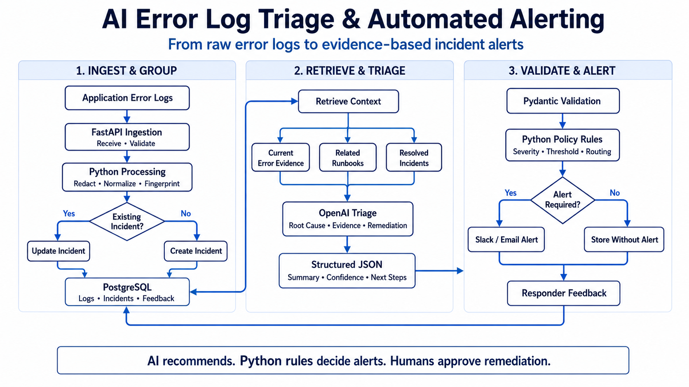

# AI Log Triage and Automated Alerting System

System design and implementation plan for an AI-assisted log triage and automated alerting system that ingests error logs, groups related failures into incidents, and sends evidence-based alerts with AI-proposed root causes and remediation guidance.

> **Core principle:** *AI proposes the diagnosis and remediation guidance; deterministic policies control severity, routing, paging, access, and production actions.*

## Executive Summary

Modern applications, APIs, containers, and cloud platforms produce large volumes of error logs. Responders are overwhelmed by noisy, duplicate, and low-signal alerts, which delays diagnosis and increases the risk of missed incidents. Manually correlating a single error with its deployment, metrics, traces, runbook, and service ownership is slow and error prone.

This system addresses that problem by automating the full triage pipeline:

1. Ingest error logs from applications, APIs, containers, cloud platforms, and infrastructure.
2. Normalize and redact sensitive information from every log.
3. Group duplicate or related errors into a single incident.
4. Enrich incidents with deployments, metrics, traces, service ownership, runbooks, and similar past incidents.
5. Use AI to propose root-cause hypotheses with supporting evidence, confidence, impact, verification steps, and remediation suggestions.
6. Send a structured alert through Slack, Microsoft Teams, or email.
7. Update an existing alert thread when the same incident recurs instead of generating repeated messages.
8. Collect responder feedback to continuously improve triage quality.

Expected benefits include **reduced alert noise**, **faster incident diagnosis**, **consistent alert formatting**, and **preserved engineering context** (the AI never invents an answer when evidence is missing).

## Goals and Non-Goals

### Goals

- Ingest and normalize error logs from multiple, heterogeneous sources.
- Redact secrets and personally identifiable information (PII) before storage or AI processing.
- Group duplicate or related errors into incidents with deterministic fingerprinting.
- Enrich incidents with deployment, metrics, traces, ownership, runbook, and historical context.
- Produce structured, evidence-backed AI triage with confidence scoring.
- Deliver structured alerts to Slack, Teams, or email.
- Update an existing alert thread on recurrence.
- Capture responder feedback and use it to improve future triage.

### Non-Goals

- The MVP will **not** automatically modify, restart, roll back, or deploy production systems.
- Human approval is always required for any remediation action.
- The MVP will not implement advanced semantic vector search (pgvector is optional only if needed).

## Requirements

### Functional Requirements

| ID | Requirement |
|----|-------------|
| FR-1 | Accept error logs via a REST API endpoint. |
| FR-2 | Normalize logs into a standard event schema. |
| FR-3 | Redact secrets, tokens, and PII from logs. |
| FR-4 | Fingerprint and group duplicate or related logs into incidents. |
| FR-5 | Enrich incidents with runbook, ownership, deployment, metric, trace, and historical-incident context. |
| FR-6 | Generate structured AI triage with root-cause hypotheses and evidence. |
| FR-7 | Send structured alerts via Slack (primary), email (fallback), and Teams (optional). |
| FR-8 | Update an existing alert thread for recurring incidents. |
| FR-9 | Store incidents, logs, runbooks, notifications, and feedback. |
| FR-10 | Apply deterministic severity, routing, paging, and alert-throttling rules. |

### Non-Functional Requirements

| Category | Requirement |
|----------|-------------|
| **Performance** | Ingestion should handle the expected peak log volume with bounded queue latency. AI analysis is asynchronous and must not block ingestion. |
| **Availability** | A basic deterministic alert must still be delivered when AI analysis is unavailable. |
| **Security** | Secrets and PII are redacted; role-based access control; tenant isolation; audit logging; encryption at rest and in transit. |
| **Reliability** | Recover gracefully from queue backlogs, notification failures, and AI timeouts. Duplicate events are deduplicated. |
| **Observability** | Metrics for ingestion volume, failures, queue latency, grouping, AI latency, notification delivery, and cost. |

## System Architecture

The system uses **Python**, **FastAPI**, **PostgreSQL (or MySQL)**, the **OpenAI API**, and **Slack/email** to convert incoming error logs into grouped incidents and evidence-based triage alerts. Async work runs in FastAPI background tasks or a simple Python worker process, backed by the database for queued jobs.

*Figure 1. AI-assisted log triage and automated alerting architecture.*

### Component Responsibilities

#### Log sources

Applications, APIs, containers, cloud platforms, and infrastructure emit error logs in various formats. Sources push logs to the ingestion endpoint, optionally with basic deployment metadata.

#### Ingestion service

A FastAPI REST endpoint accepts raw logs, performs initial validation, and normalizes them into a standard event schema.

#### Message queue / event bus

The MVP avoids Kafka and RabbitMQ. Asynchronous processing uses **FastAPI background tasks** or a **simple Python worker process**, with queued jobs stored in the database.

#### Log normalization and secret-redaction service

Normalizes timestamps, fields, and formats. Redacts secrets, tokens, keys, and PII before the log is stored or sent to the AI.

#### Incident fingerprinting and grouping engine

Computes a deterministic fingerprint from service name, error type, surrounding context, and keywords. Groups matching fingerprints within a time window into a single incident.

#### Context-enrichment service

Pulls related context: recent deployments, metrics, traces, service ownership, runbook references, and previously resolved incidents.

#### Runbook and historical-incident retrieval system

Performs direct keyword search over runbooks and resolved incidents stored in PostgreSQL (or MySQL). pgvector is optional if semantic search is later needed.

#### AI triage engine

Sends the evidence package to the OpenAI API and requests structured JSON output. The model proposes ranked root-cause hypotheses with confidence, evidence, verification steps, and remediation suggestions, citing supporting evidence for every claim.

#### Safety and policy gate

Deterministic policies control severity, routing, paging, access, and production actions. The AI may propose; the gate decides and enforces.

#### Slack, Teams, and email notification service

Sends structured alerts via Slack incoming webhook (primary), Python SMTP email (fallback), and Teams webhook (optional).

#### Incident tracking and responder-feedback system

Tracks incidents, updates alert threads on recurrence, and collects responder feedback to improve future triage.

#### Storage, search, monitoring, and audit services

Stores logs, incidents, runbooks, resolved incidents, notifications, and feedback. Records an audit trail of AI outputs and decisions. CloudWatch (or equivalent) monitors the application.

## End-to-End Processing Flow

1. An application error log is received by the FastAPI REST endpoint.
2. Python validates and redacts sensitive data.
3. The normalized log is stored in PostgreSQL (or MySQL).
4. Python fingerprinting groups the log into an existing or new incident.
5. The retrieval layer queries runbooks and previously resolved incidents.
6. The OpenAI API performs structured triage on the evidence package.
7. Pydantic validates the structured AI response; unsupported claims are rejected or downgraded.
8. Deterministic alerting rules evaluate severity, throttling, and routing.
9. A Slack, Teams, or email alert is sent (or the existing thread is updated).
10. The audit and feedback record is stored for future improvement.

## Data Design

### Normalized Log Event

| Field | Type | Description |
|-------|------|-------------|
| `event_id` | UUID | Unique event identifier |
| `timestamp` | Datetime | Time the event occurred |
| `source` | String | Application, API, container, cloud, or infrastructure |
| `service_name` | String | Owning service |
| `environment` | String | e.g. `prod`, `staging` |
| `region` | String | Deployment region |
| `log_level` | String | `error`, `warning`, etc. |
| `error_type` | String | Normalized error type |
| `message` | Text | Sanitized log message |
| `fingerprint` | String | Grouping key for incident identity |
| `metadata` | JSONB/JSON | Variable attributes (trace id, request id, etc.) |

### AI Triage Output

The structured AI triage result includes:

- **Incident ID**
- **Summary**
- **Severity**
- **Impacted service and environment**
- **Occurrence count and time window**
- **Ranked root-cause hypotheses**
- **Confidence** for each hypothesis
- **Evidence** supporting each hypothesis
- **Information that contradicts** each hypothesis
- **Verification steps**
- **Recommended remediation actions**
- **Risk level** for each action
- **Runbook references**
- **Missing information**
- **Owning team**
- **Escalation recommendation**
- **Model and prompt-version metadata**

## AI and RAG Design

The MVP implements retrieval-augmented generation (RAG) directly, without LangChain or LlamaIndex:

1. Receive and sanitize an error log.
2. Extract its service name, error type, keywords, and fingerprint.
3. Query PostgreSQL (or MySQL) for related runbooks and previously resolved incidents using keyword search.
4. Combine the retrieved context with the current error into an evidence package.
5. Send the evidence package to the OpenAI API.
6. Require structured JSON output.
7. Validate the output using Pydantic.
8. Reject or downgrade claims that do not contain supporting evidence.

Every root-cause hypothesis must reference supporting evidence. The model must explicitly state when evidence is insufficient rather than inventing an answer. Unsupported claims are rejected or downgraded by the validation layer.

## Incident Grouping and Severity Logic

- **Fingerprinting:** deterministic hash of service name, error type, and normalized context.
- **Deduplication:** identical fingerprints within a time window collapse into one incident.
- **Time windows:** an incident groups events that occur within a configurable window and stays open until a silent period.
- **Severity rules:** deterministic thresholds based on service criticality, environment, occurrence count, and user impact.
- **Alert thresholds and rate limiting:** alerts are suppressed or throttled above configured rates.
- **Incident-thread updates:** a recurring incident updates the existing alert thread rather than sending a new message.

Severity and paging are controlled by **deterministic rules**, never by AI alone.

## Alert Format

An example Slack, Teams, or email alert contains:

- Severity and affected service
- Environment and region
- Start time and occurrence count
- Concise incident summary
- Likely root cause and confidence
- Supporting evidence
- Verification steps
- Safe remediation suggestions
- Service owner
- Links to logs, dashboards, traces, deployments, runbooks, and incident records

## Security and Safety

- **Secret and PII redaction** before storage or AI processing.
- **Prompt-injection protection** on untrusted log content.
- **Role-based access control** for dashboards and APIs.
- **Tenant isolation** for multi-tenant environments.
- **Audit logging** of AI outputs and policy decisions.
- **Data retention** policies for logs and incidents.
- **Encryption** at rest and in transit.
- **Model access restrictions** and credential management via AWS Secrets Manager.
- **Human approval** is required for any remediation action.

## Failure Handling

| Failure | Behavior |
|---------|----------|
| Model timeout | Continue with deterministic alert; mark AI analysis as pending/unavailable. |
| Invalid AI response | Reject, retry once, then fall back to deterministic alert. |
| Notification failure | Retry, then escalate to fallback channel (email). |
| Queue backlog | Bound the queue; ingestion remains non-blocking. |
| Duplicate events | Deduplicate via fingerprinting. |
| Unavailable knowledge sources | Retrieve what is available; flag missing context. |
| Excessive alert volume | Apply rate limiting and suppression. |

The system **always** sends a basic deterministic alert when AI analysis is unavailable.

## Observability

Track metrics for:

- Ingestion volume
- Processing failures
- Queue latency
- Grouping effectiveness
- AI latency
- Notification delivery
- False-positive rate
- Triage usefulness
- Token usage
- Cost per incident

## Testing Strategy

- **Unit tests** for redaction, grouping, retrieval, and validation.
- **Integration tests** for the ingestion-to-alert pipeline.
- **Security tests** for redaction and prompt-injection resistance.
- **Adversarial tests** for malformed or malicious logs.
- **Resilience tests** for AI timeouts and notification failures.
- **Load tests** for queue behavior under peak volume.
- **Human evaluation** of triage accuracy and remediation usefulness.

Recommend a historical **golden dataset** of resolved incidents to measure root-cause accuracy and remediation usefulness.

## Implementation Roadmap

1. **Discovery and requirements** — confirm sources, volume, retention, and channels.
2. **Deterministic ingestion and alerting MVP** — ingestion, redaction, grouping, and basic alerts.
3. **AI-assisted triage and RAG** — structured AI output, retrieval, and validation.
4. **Feedback, evaluation, and production hardening** — feedback loop, golden dataset, observability.
5. **Optional controlled automation** — only with humans in the loop.

## MVP Backlog

Prioritized engineering tasks, each with dependencies, acceptance criteria, and suggested ownership:

| Priority | Task | Dependency | Acceptance Criteria |
|----------|------|-----------|--------------------|
| P0 | Log ingestion REST endpoint | — | Logs accepted and validated |
| P0 | Redaction service | — | Secrets and PII removed from stored/AI data |
| P0 | Grouping engine | Ingestion | Duplicates collapsed into incidents |
| P0 | Alert policy + Slack/email | Grouping | Deterministic alerts delivered |
| P1 | Context retrieval (runbooks/history) | Database schema | Relevant context returned |
| P1 | AI triage + Pydantic validation | Retrieval | Structured, evidence-backed output |
| P1 | Incident tracking + thread updates | Grouping | Recurring incidents update thread |
| P2 | Feedback collection | Triage | Responder feedback stored |
| P2 | Observability and audit | Core pipeline | Metrics and audit trail available |

## Risks and Design Decisions

### Risks

- **AI hallucination** — mitigated by evidence requirements and validation.
- **Prompt injection** via log content — mitigated by sanitization and isolation.
- **Alert fatigue** — mitigated by deterministic grouping and throttling.
- **Credential leakage** — mitigated by redaction and Secrets Manager.

### Decisions Still to Be Made

- Cloud provider (AWS proposed) and region
- Logging platform integration
- Primary messaging channel (Slack proposed; Teams/email optional)
- Model provider (OpenAI proposed) and model version
- Knowledge sources and their refresh cadence
- Expected log volume and retention requirements
- Incident-management platform integration
- Database of record: **PostgreSQL** or **MySQL** (both supported; the spec permits MySQL for data)

### Confirmed vs. Unresolved

- **Confirmed:** core architecture, RAG approach, deterministic policy gate, evidence-backed AI output.
- **Assumptions:** expected volumes, specific integrations, and ownership will be confirmed during discovery.
- **Recommended:** begin with a read-only system; do not propose autonomous production remediation for the MVP.
