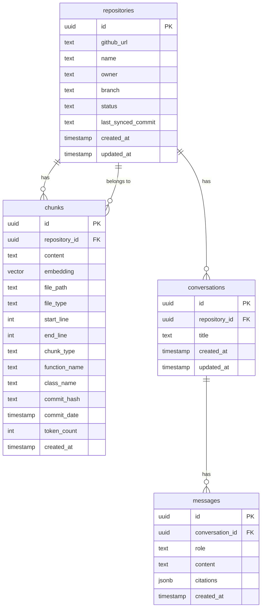

# API Design

This section covers the backend API endpoints, frontend component architecture, and database schema that define RepoLens's interface and data layer.

## Backend API

The FastAPI backend exposes a RESTful API organized into resource-based endpoints. All responses follow a consistent JSON envelope format.

### Response Envelope

```python
class APIResponse(BaseModel):
    success: bool
    data: Any | None = None
    error: str | None = None
    metadata: dict | None = None
```

### Repository Endpoints

| Method | Endpoint | Description |
|--------|----------|-------------|
| `POST` | `/api/v1/repositories` | Connect a new GitHub repository for indexing |
| `GET` | `/api/v1/repositories` | List all connected repositories |
| `GET` | `/api/v1/repositories/{id}` | Get repository details and ingestion status |
| `DELETE` | `/api/v1/repositories/{id}` | Disconnect and remove a repository |
| `POST` | `/api/v1/repositories/{id}/sync` | Trigger an incremental sync |
| `GET` | `/api/v1/repositories/{id}/stats` | Get chunk counts, file breakdown, and index size |

**Connect Repository**

```json
// POST /api/v1/repositories
// Request
{
  "github_url": "https://github.com/myorg/myproject",
  "branch": "main"
}

// Response
{
  "success": true,
  "data": {
    "id": "a1b2c3d4-e5f6-7890-abcd-ef1234567890",
    "github_url": "https://github.com/myorg/myproject",
    "name": "myproject",
    "owner": "myorg",
    "branch": "main",
    "status": "ingesting",
    "created_at": "2026-09-03T10:00:00Z"
  }
}
```

**Repository Status**

```json
// GET /api/v1/repositories/a1b2c3d4-e5f6-7890-abcd-ef1234567890
{
  "success": true,
  "data": {
    "id": "a1b2c3d4-e5f6-7890-abcd-ef1234567890",
    "name": "myproject",
    "status": "ready",
    "stats": {
      "total_chunks": 1847,
      "code_chunks": 1423,
      "doc_chunks": 312,
      "commit_chunks": 112,
      "files_indexed": 289,
      "last_synced_commit": "a3f8b2c"
    },
    "updated_at": "2026-09-03T10:05:32Z"
  }
}
```

### Query Endpoint

| Method | Endpoint | Description |
|--------|----------|-------------|
| `POST` | `/api/v1/query` | Ask a natural-language question about a repository |

```json
// POST /api/v1/query
// Request
{
  "repository_id": "a1b2c3d4-e5f6-7890-abcd-ef1234567890",
  "question": "How does the authentication middleware work?",
  "conversation_id": "optional-existing-conversation-id"
}

// Response
{
  "success": true,
  "data": {
    "answer": "The authentication middleware intercepts incoming requests and validates JWT tokens before passing them to route handlers. It extracts the `Authorization` header, decodes the token using `validate_token()` from `src/auth/jwt.py`, and attaches the decoded payload to the request state. Routes can opt out by being listed in `exclude_paths`.\n\n[Source 1] validates the token, handling expired and invalid token cases. [Source 2] implements the middleware class that orchestrates the validation flow.",
    "citations": [
      {
        "source_index": 1,
        "file_path": "src/auth/jwt.py",
        "start_line": 45,
        "end_line": 82,
        "chunk_type": "code",
        "function_name": "validate_token",
        "preview": "def validate_token(token: str) -> TokenPayload:\n    \"\"\"Validate a JWT token...\"",
        "similarity_score": 0.82
      },
      {
        "source_index": 2,
        "file_path": "src/auth/middleware.py",
        "start_line": 12,
        "end_line": 35,
        "chunk_type": "code",
        "class_name": "AuthenticationMiddleware",
        "preview": "class AuthenticationMiddleware:\n    def __init__(self, app, ...",
        "similarity_score": 0.79
      }
    ],
    "confidence": "high",
    "conversation_id": "conv-xyz-789"
  }
}
```

### Conversation Endpoints

| Method | Endpoint | Description |
|--------|----------|-------------|
| `GET` | `/api/v1/conversations/{id}` | Retrieve conversation history |
| `GET` | `/api/v1/conversations/{id}/messages` | List messages in a conversation |
| `DELETE` | `/api/v1/conversations/{id}` | Delete a conversation |

### System Endpoints

| Method | Endpoint | Description |
|--------|----------|-------------|
| `GET` | `/api/v1/health` | Health check |
| `GET` | `/api/v1/status` | System status (database, embedding service, LLM) |

## Frontend Components

The React frontend is organized into a component hierarchy that separates concerns between data fetching, state management, and presentation.

### Component Tree

```
App
├── Layout
│   ├── Sidebar
│   │   ├── RepositoryList
│   │   │   └── RepositoryCard
│   │   └── StatusIndicator
│   └── MainContent
│       ├── QueryView
│       │   ├── QueryInput
│       │   ├── ConversationHistory
│       │   │   └── MessageBubble
│       │   │       └── CitationInline
│       │   └── ResponsePanel
│       │       └── CitationSidebar
│       │           └── CitationCard
│       └── RepositoryView
│           ├── IngestionProgress
│           ├── RepositoryStats
│           └── FileExplorer
```

### Key Components

| Component | Responsibility |
|-----------|---------------|
| `RepositoryList` | Fetches and displays connected repositories with status badges |
| `QueryInput` | Text input with keyboard shortcut (Enter to submit, Shift+Enter for newline) |
| `ConversationHistory` | Renders the message thread with auto-scroll to latest |
| `MessageBubble` | Renders a single message, processing markdown and citation references |
| `CitationInline` | Interactive badge that highlights the corresponding citation in the sidebar |
| `CitationSidebar` | Collapsible panel showing all source references with code previews |
| `IngestionProgress` | Real-time progress bar with file count and stage indicator |
| `FileExplorer` | Browse indexed files with chunk counts per file |

### State Management

The frontend uses React hooks and context for state management. There is no external state library — the application state is manageable with `useState` and `useReducer` at the component level, and `useContext` for shared state like the active repository and conversation.

| Context | Scope |
|---------|-------|
| `RepositoryContext` | Active repository, repository list, ingestion status |
| `ConversationContext` | Active conversation, message history |
| `SystemContext` | Backend health status, feature flags |

## Database Schema

See the [Embedding & Storage](embedding-storage.md) section for the full schema definition. The key tables are:

| Table | Purpose |
|-------|---------|
| `repositories` | Connected repository metadata and sync state |
| `chunks` | Indexed code and documentation chunks with embeddings |
| `conversations` | User conversation sessions |
| `messages` | Individual messages within conversations |

### Entity Relationships


