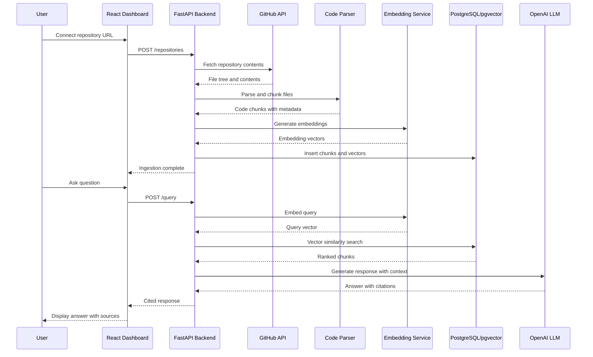

# System Architecture

RepoLens follows a modular pipeline architecture where each stage operates as an independent service communicating through well-defined interfaces.

## High-Level Architecture

## Component Breakdown

### Ingestion Pipeline

The ingestion pipeline operates asynchronously when a user connects a repository. It fetches source files, documentation, and commit history through the GitHub API, then passes each file to the code parser.

| Component | Responsibility |
|-----------|---------------|
| **GitHub API Client** | Authenticated access to repository contents, file trees, and commit history |
| **File Filter** | Excludes binary files, vendor directories, generated code, and lock files based on configurable ignore patterns |
| **Code Parser & Chunker** | Language-aware splitting that respects AST boundaries — function definitions, class declarations, and module-level structures |
| **Commit Parser** | Extracts commit messages, authors, and file change summaries for temporal context |
| **Embedding Service** | Generates vector embeddings for each chunk via the OpenAI `text-embedding-3-small` model |
| **Storage Writer** | Writes chunks and embeddings to PostgreSQL with pgvector indexing |

### Query Pipeline

The query pipeline runs synchronously on each user request. It embeds the query, retrieves relevant chunks, reranks them, and generates a cited response.

| Component | Responsibility |
|-----------|---------------|
| **Query Embedder** | Converts the natural-language question into an embedding vector |
| **Vector Retriever** | Performs approximate nearest neighbor search against the pgvector index |
| **Reranker** | Reorders retrieved chunks by semantic relevance to the specific query |
| **Context Assembler** | Builds the prompt from ranked chunks, conversation history, and system instructions |
| **Language Model** | Generates a grounded answer via the OpenAI `gpt-4o` model |
| **Citation Formatter** | Extracts file paths, line numbers, and source references from the generation for display |

### Frontend Dashboard

The React frontend provides the user interface for repository management, querying, and result display.

| Component | Responsibility |
|-----------|---------------|
| **Repository Manager** | Connect, list, and remove indexed repositories |
| **Query Interface** | Natural-language input with conversation history |
| **Response Viewer** | Rendered markdown with inline file citations and hover previews |
| **Citation Sidebar** | Collapsible panel showing all source references for the current answer |
| **Status Dashboard** | Ingestion progress, repository statistics, and system health |

## Service Communication

All communication between the backend services happens within a single FastAPI process. The frontend communicates with the backend through a REST API. There is no message queue or inter-service bus in the current architecture — ingestion runs as a background task within FastAPI using `BackgroundTasks`.

## Design Decisions

**Single-process backend**: Ingestion and query pipelines run within one FastAPI process. This simplifies deployment and eliminates the need for message brokers during the current scale. Background ingestion uses FastAPI's `BackgroundTasks`, which runs in a thread pool.

**PostgreSQL with pgvector**: Combines transactional data (repository metadata, user sessions) with vector similarity search in one database. This avoids managing a separate vector database like Pinecone or Weaviate and keeps the deployment topology simple.

**OpenAI for both embeddings and generation**: Using the same provider for `text-embedding-3-small` (embeddings) and `gpt-4o` (generation) simplifies API key management and ensures consistent token handling across the pipeline.

**React frontend**: Component-based architecture handles the dynamic citation display, conversation history, and repository management UI. The frontend is a static build served by nginx in production.
