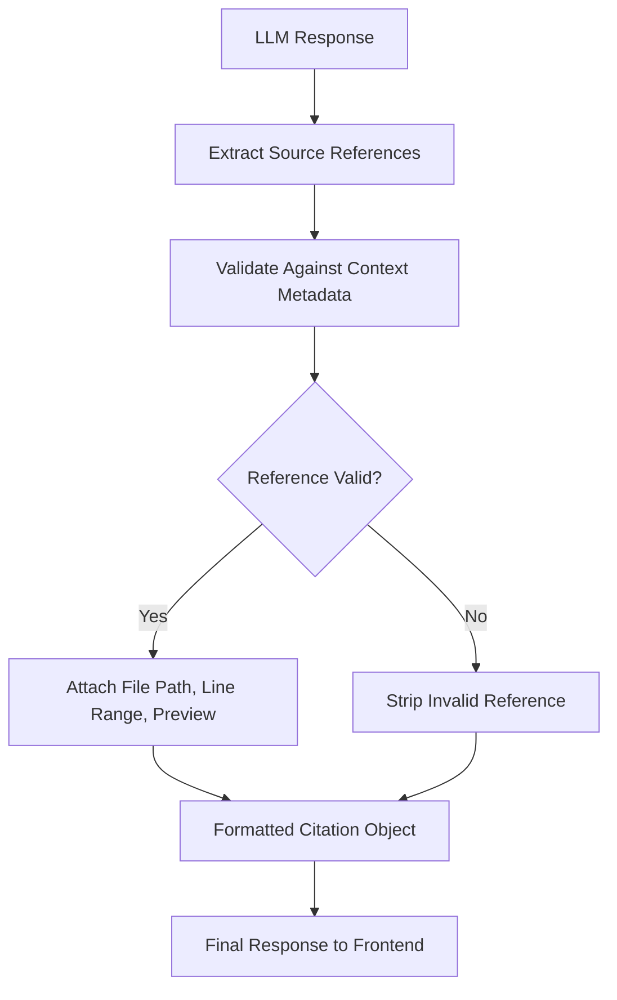

# File-Level Citations and Hallucination Reduction

Every response from RepoLens includes verifiable citations that trace back to specific files and line ranges in the indexed repository. The citation system works in tandem with guardrails that reduce the likelihood of hallucinated references.

## Citation System

### How Citations Work

When the language model generates a response, it includes inline references in the format `[Source N]`. The citation extraction pipeline validates these references against the metadata of chunks that were provided in the context.



### Citation Object Structure

Each citation includes the information the frontend needs to display a source reference:

```python
@dataclass
class Citation:
    source_index: int          # [Source N] reference number
    file_path: str             # e.g., "src/auth/jwt.py"
    start_line: int            # First line (1-indexed)
    end_line: int              # Last line (inclusive)
    chunk_type: str            # "code", "documentation", "commit"
    preview: str               # First 200 characters of the chunk
    function_name: str | None  # If the chunk defines a function
    class_name: str | None     # If the chunk defines a class
    similarity_score: float    # Cosine similarity from retrieval
```

### Citation Validation

The citation extractor validates every reference in the model output:

1. **Parse references**: Extract all `[Source N]` patterns from the response text
2. **Map to context**: Match each `N` to the corresponding chunk in the assembled context
3. **Verify existence**: Confirm the chunk metadata exists and contains valid file paths and line numbers
4. **Strip invalid**: Remove references that do not map to a valid context chunk
5. **Deduplicate**: Merge multiple references to the same file into a single citation

## Hallucination Reduction

### Grounded Generation

The primary defense against hallucination is grounding the generation in retrieved context. The system prompt explicitly instructs the model to answer only using provided sources and to acknowledge gaps in available information.

### Source-Only Prompting

The context block presented to the model contains only chunks retrieved from the actual codebase. No general knowledge about the codebase is injected. This constrains the model to reference only what exists in the sources.

### Reference Validation

Beyond the system prompt, the citation extraction pipeline provides a mechanical safeguard. Even if the model generates a plausible-sounding file path that does not exist in the context, the citation extractor strips it before the response reaches the user. This prevents the frontend from displaying references to nonexistent files.

### Confidence Indicators

The response includes a confidence indicator based on the quality of the retrieved context:

| Condition | Confidence Level |
|-----------|-----------------|
| Top retrieved chunk has similarity > 0.7 | High |
| Top retrieved chunk has similarity 0.4–0.7 | Medium |
| Top retrieved chunk has similarity < 0.4 | Low |
| No chunks above threshold | None |

When confidence is "Low" or "None," the response includes a disclaimer that the answer may be incomplete or based on tangentially related code.

### No-Answer Handling

RepoLens is designed to say "I don't have enough information" rather than guess. The system prompt includes explicit instructions for this:

```
If the provided sources do not contain enough information to answer the
question, say: "Based on the indexed codebase, I don't have enough context
to answer this question. The following files may be relevant but don't
contain the specific information you're asking about: [list relevant file
paths]."
```

This fallback response still provides value by directing the developer to potentially relevant files, even when a direct answer is not available.

## Frontend Citation Display

The React dashboard renders citations as interactive elements within the response:

- **Inline references**: `[Source 1]` becomes a clickable badge that scrolls to the citation detail
- **Citation sidebar**: A collapsible panel listing all source references with file paths, line ranges, and code previews
- **File path links**: Each citation file path links to the corresponding file view within the dashboard
- **Hover previews**: Hovering over an inline citation shows a code snippet preview without leaving the response

## Commit-Level Citations

For questions about recent changes or development history, commit-history chunks provide citations that include:

- Commit hash (abbreviated, 7 characters)
- Commit message
- Author name and date
- List of files changed in that commit

This enables responses like: "The authentication middleware was updated in commit `a3f8b2c` by Jane Smith on March 15, 2026, which added JWT token validation to the `/api/admin` route."
