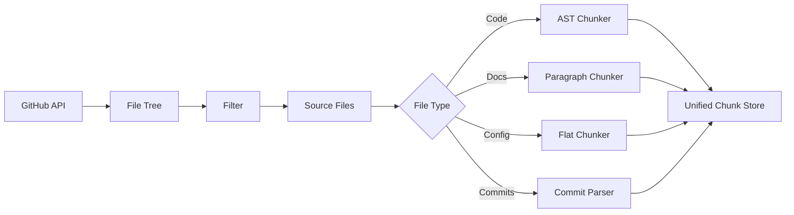

# Repository Ingestion

RepoLens ingests GitHub repositories by fetching source files, documentation, commit history, and repository metadata, then splitting them into semantically meaningful chunks for embedding.

## Ingestion Pipeline



## GitHub API Integration

The ingestion service authenticates with a GitHub personal access token and uses the REST API v3 to fetch repository contents. For large repositories, it uses the Git Trees API to retrieve the full file tree in a single request, then fetches individual file contents in parallel.

### Authentication

```python
import httpx

headers = {
    "Authorization": f"token {github_token}",
    "Accept": "application/vnd.github.v3+json"
}

async with httpx.AsyncClient() as client:
    tree = await client.get(
        f"https://api.github.com/repos/{owner}/{repo}/git/trees/{branch}?recursive=1",
        headers=headers
    )
```

### Rate Limiting

The GitHub API enforces rate limits of 5,000 requests per hour for authenticated users. The ingestion service tracks remaining requests via the `X-RateLimit-Remaining` header and introduces delays when the limit approaches a safety threshold. For repositories exceeding the rate limit during initial ingestion, the service queues remaining files and resumes after the rate limit window resets.

## File Filtering

Before chunking, files pass through a multi-stage filter:

| Filter | Purpose |
|--------|---------|
| **Binary detection** | Skips files with binary content signatures (images, compiled binaries, fonts) |
| **Size limit** | Excludes files exceeding 1 MB (configurable) |
| **Extension allowlist** | Only processes known source, documentation, and configuration extensions |
| **Path exclusion** | Respects patterns from `.gitignore` and a configurable ignore list |

### Default Exclusion Patterns

```
node_modules/
vendor/
__pycache__/
.git/
*.min.js
*.min.css
*.map
*.pyc
*.so
*.dylib
*.exe
dist/
build/
.next/
.nuxt/
```

## Code-Aware Chunking

The code chunker uses language-specific AST parsing to split source files at meaningful boundaries. This produces chunks that represent coherent units of logic rather than arbitrary character offsets.

### Chunking Strategy

The chunker applies a two-pass approach:

**Pass 1 — AST Boundary Detection**: Parse the file into an AST using language-specific parsers (`tree-sitter` for multi-language support). Identify top-level and nested function definitions, class declarations, module-level imports, and comments.

**Pass 2 — Chunk Assembly**: Group AST nodes into chunks that fall within the target token range (200–500 tokens). When a single function exceeds the range, it becomes its own chunk. When multiple small functions exist, they are grouped into a single chunk up to the token limit.

### Supported Languages

| Language | Parser | Chunking Granularity |
|----------|--------|---------------------|
| Python | `tree-sitter-python` | Functions, classes, decorators |
| JavaScript | `tree-sitter-javascript` | Functions, classes, arrow functions |
| TypeScript | `tree-sitter-typescript` | Functions, classes, interfaces, types |
| Go | `tree-sitter-go` | Functions, methods, structs |
| Rust | `tree-sitter-rust` | Functions, impl blocks, traits |
| Java | `tree-sitter-java` | Methods, classes, interfaces |
| Ruby | `tree-sitter-ruby` | Methods, classes, modules |
| C/C++ | `tree-sitter-c` / `tree-sitter-cpp` | Functions, structs, classes |

### Chunk Metadata

Each chunk carries metadata that travels through the pipeline to the citation system:

```python
@dataclass
class ChunkMetadata:
    repository_id: str        # Repository identifier
    file_path: str            # Path within the repository
    file_type: str            # Language or file category
    start_line: int           # First line number (1-indexed)
    end_line: int             # Last line number (inclusive)
    chunk_type: str           # "code", "documentation", "config", "commit"
    function_name: str | None # If chunk contains a function definition
    class_name: str | None    # If chunk contains a class definition
    commit_hash: str | None   # For commit-history chunks
    commit_date: str | None   # ISO format date of the commit
    token_count: int          # Approximate token count
```

## Documentation Chunking

Markdown and reStructuredText files are split at heading boundaries and paragraph breaks. Each chunk preserves its heading hierarchy so the embedding captures the structural context:

```markdown
## Database Design

RepoLens uses PostgreSQL with pgvector...

### Vector Index

The HNSW index provides...
```

Each heading level becomes part of the chunk metadata, enabling the retrieval system to distinguish between a chunk about "Database Design > Vector Index" and one about "Database Design > Connection Pooling."

## Commit History Ingestion

Git commit history is ingested as structured records. Each commit produces a chunk containing:

- Commit hash (abbreviated)
- Commit message
- Author name and date
- Summary of changed files
- Diff summary (files added, modified, deleted)

Commit chunks provide temporal context that helps answer questions like "What was changed recently?" or "Who wrote this authentication module?"

## Incremental Sync

After initial ingestion, subsequent sync operations fetch only new commits and modified files using the GitHub Compare API. The system tracks the last-synced commit hash per repository and performs differential updates, avoiding full re-ingestion on every sync.
