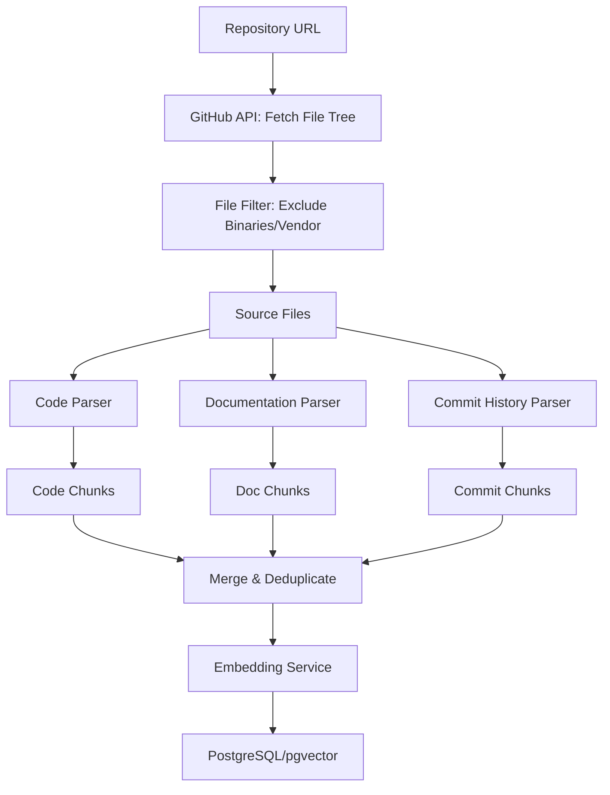
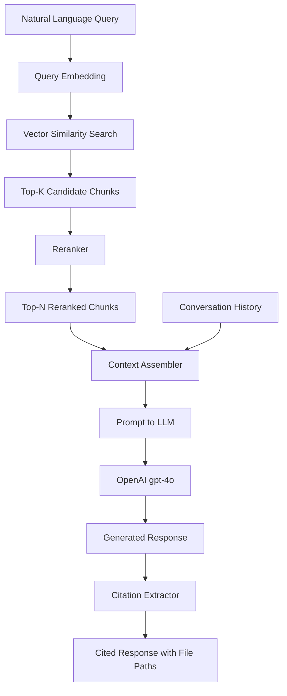

# RAG Workflow

RepoLens implements a retrieval-augmented generation (RAG) pipeline that grounds every response in actual repository content. The pipeline operates in two phases: ingestion (offline) and query (online).

## Ingestion Phase

The ingestion phase transforms a raw GitHub repository into a searchable vector index. This runs once when a repository is connected and again on subsequent sync operations.

### Step 1: Repository Fetch

The ingestion service authenticates with the GitHub API and retrieves the full file tree for the target repository. It respects `.gitignore` rules and a configurable exclusion list that filters out binary files, `node_modules/`, `vendor/`, `__pycache__/`, lock files, and generated code.

### Step 2: File Classification

Each file passes through a classifier that determines its type:

| File Type | Handling |
|-----------|----------|
| Source code (`.py`, `.js`, `.ts`, `.go`, `.rs`, etc.) | Parsed by the language-aware code chunker |
| Documentation (`.md`, `.rst`, `.txt`) | Split into paragraph-level chunks |
| Configuration (`.yaml`, `.json`, `.toml`) | Chunked as flat text with file context |
| Commit history | Parsed into individual commit records with message, author, date, and changed files |

### Step 3: Code-Aware Chunking

Source files are split using AST-aware boundaries. The chunker identifies function definitions, class declarations, and module-level blocks, then groups them into chunks that respect a target token range (200–500 tokens). See [Repository Ingestion](ingestion.md) for details.

### Step 4: Embedding Generation

Each chunk is sent to the OpenAI Embeddings API using the `text-embedding-3-small` model. Chunks are batched to stay within API rate limits. The resulting 1536-dimensional vectors are stored alongside the chunk text and metadata.

### Step 5: Storage

Chunks, embeddings, and metadata are written to PostgreSQL with pgvector. An HNSW index is created on the embedding column for fast approximate nearest neighbor search.

## Query Phase

The query phase runs on every user question and produces a grounded, cited response.

### Step 1: Query Embedding

The user's natural-language question is converted to a 1536-dimensional vector using the same `text-embedding-3-small` model used during ingestion.

### Step 2: Vector Search

The query vector is matched against the pgvector HNSW index using cosine similarity. The system retrieves the top 20 candidate chunks with similarity scores above a configurable threshold (default: 0.3).

### Step 3: Reranking

The 20 candidates are passed to a cross-encoder reranker that scores each chunk's relevance to the specific query. The reranker produces a tighter relevance ordering than embedding similarity alone, because it reads the full query-chunk pair rather than comparing pre-computed vectors.

### Step 4: Context Assembly

The top 8 reranked chunks are assembled into a structured context block. The context includes:

- Chunk text content
- File path and line range for each chunk
- Chunk type label (code, documentation, commit)
- Conversation history from the current session (up to the last 10 turns)

### Step 5: Response Generation

The assembled context, conversation history, and a system prompt are sent to the OpenAI `gpt-4o` model. The system prompt instructs the model to:

1. Answer only using provided context
2. Cite specific file paths and line numbers
3. Acknowledge when the context does not contain sufficient information
4. Avoid fabricating code references or file paths that do not exist in the context

### Step 6: Citation Extraction

The raw model output passes through a citation extractor that validates every referenced file path and line number against the chunk metadata. Invalid references are stripped. Valid references are formatted with file paths, line ranges, and optional hover preview data for the frontend.
