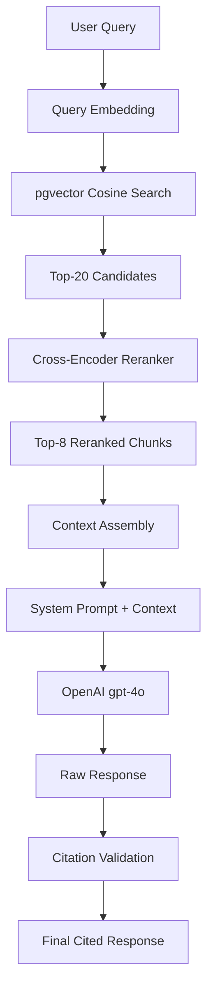

# Retrieval, Reranking, and Response Generation

RepoLens retrieves relevant code chunks through vector similarity search, reranks them with a cross-encoder model, and generates a grounded response using a large language model with the ranked context.

## Retrieval Pipeline



## Vector Search

The initial retrieval stage uses pgvector's approximate nearest neighbor (ANN) search with cosine similarity. This retrieves a broad set of candidates quickly, trading some recall for latency.

### Search Parameters

| Parameter | Default | Purpose |
|-----------|---------|---------|
| `top_k` | 20 | Number of initial candidates to retrieve |
| `similarity_threshold` | 0.3 | Minimum cosine similarity to include a chunk |
| `ef_search` | 100 | HNSW search width — higher means better recall |

### Search Implementation

```python
async def vector_search(
    query_embedding: list[float],
    repository_id: str,
    top_k: int = 20,
    threshold: float = 0.3
) -> list[ChunkResult]:
    rows = await db.fetch(
        """
        SELECT
            id, content, file_path, file_type, start_line, end_line,
            chunk_type, function_name, class_name,
            1 - (embedding <=> $1::vector) AS similarity
        FROM chunks
        WHERE repository_id = $2
          AND 1 - (embedding <=> $1::vector) > $3
        ORDER BY embedding <=> $1::vector
        LIMIT $4
        """,
        query_embedding, repository_id, threshold, top_k
    )
    return [ChunkResult(**row) for row in rows]
```

The 0.3 similarity threshold filters out chunks that are semantically distant from the query. This threshold was determined by evaluating retrieval precision on a set of representative codebase queries.

## Reranking

The initial vector search retrieves candidates based on embedding similarity, which captures broad semantic relationships. Reranking refines this by scoring each candidate against the full query text using a cross-encoder model.

### Cross-Encoder Reranking

The reranker reads the query and each candidate chunk together, producing a relevance score for each pair. Unlike bi-encoder embeddings (which encode query and chunk independently), the cross-encoder can capture fine-grained interactions between the query terms and chunk content.

```python
from sentence_transformers import CrossEncoder

reranker = CrossEncoder("cross-encoder/ms-marco-MiniLM-L-6-v2")

def rerank_chunks(query: str, chunks: list[ChunkResult], top_n: int = 8) -> list[ChunkResult]:
    pairs = [(query, chunk.content) for chunk in chunks]
    scores = reranker.predict(pairs)
    scored_chunks = list(zip(chunks, scores))
    scored_chunks.sort(key=lambda x: x[1], reverse=True)
    return [chunk for chunk, score in scored_chunks[:top_n]]
```

### Why Reranking Matters

Embedding similarity is computed from pre-computed vectors, which compress the semantic relationship into a fixed dimensionality. Cross-encoders read the full text of both query and chunk, allowing them to:

- Distinguish between queries about "authentication" in the context of JWT tokens versus OAuth flows
- Recognize when a chunk contains the exact function name referenced in the query
- Score code chunks higher when they contain error handling patterns the query asks about

## Context Assembly

The top 8 reranked chunks are formatted into a structured context block that the language model can reference. The context preserves file paths, line numbers, and chunk type metadata so the model can cite sources accurately.

### Context Format

```
--- Repository: myorg/myproject ---

[Source 1: src/auth/jwt.py:45-82 | code]
def validate_token(token: str) -> TokenPayload:
    """Validate a JWT token and return the decoded payload."""
    try:
        payload = jwt.decode(token, SECRET_KEY, algorithms=["HS256"])
        return TokenPayload(**payload)
    except jwt.ExpiredSignatureError:
        raise AuthenticationError("Token has expired")
    except jwt.InvalidTokenError:
        raise AuthenticationError("Invalid token")

[Source 2: src/auth/middleware.py:12-35 | code]
class AuthenticationMiddleware:
    def __init__(self, app, exclude_paths: list[str] = None):
        self.app = app
        self.exclude_paths = exclude_paths or ["/health", "/docs"]

    async def __call__(self, scope, receive, send):
        if scope["path"] in self.exclude_paths:
            await self.app(scope, receive, send)
            return
        # ... token extraction and validation
```

### Conversation History

The last 10 turns of conversation history are included after the source context. This enables follow-up questions like "Can you explain that function in more detail?" or "How does that connect to the user model?"

## Response Generation

The assembled context, conversation history, and system prompt are sent to the OpenAI `gpt-4o` model.

### System Prompt

```
You are RepoLens, a codebase onboarding assistant. You answer questions
about a codebase using ONLY the provided source code and documentation.

Rules:
1. Answer using only the provided sources. If the sources do not contain
   sufficient information, say so clearly.
2. Cite sources using the format [Source N] when referencing specific code
   or documentation.
3. Always include file paths and line numbers when referencing code.
4. Do not fabricate file paths, function names, or code that does not
   appear in the provided sources.
5. If a question requires knowledge beyond the provided context, state
   what you can determine from the sources and what would require
   additional investigation.
6. For code questions, explain the purpose and behavior of the code, not
   just its syntax.
```

### Generation Parameters

| Parameter | Value | Rationale |
|-----------|-------|-----------|
| `model` | `gpt-4o` | Best reasoning capability for code comprehension |
| `temperature` | 0.1 | Low temperature for factual, consistent responses |
| `max_tokens` | 2048 | Sufficient for detailed code explanations |
| `top_p` | 1.0 | No nucleus sampling — rely on temperature for control |

## Latency Characteristics

| Stage | Typical Latency |
|-------|----------------|
| Query embedding | 50–150 ms |
| Vector search | 10–50 ms |
| Reranking (20 chunks) | 100–300 ms |
| LLM generation | 1–3 seconds |
| Citation extraction | < 10 ms |
| **Total** | **1.5–4 seconds** |

## Fallback Behavior

When the retrieval pipeline encounters issues, it follows a degradation strategy:

| Scenario | Behavior |
|----------|----------|
| No chunks above similarity threshold | Returns a message explaining that no relevant code was found |
| Vector search fails | Falls back to keyword search using PostgreSQL full-text search |
| Reranker unavailable | Uses embedding similarity scores directly (no reranking) |
| LLM API fails | Returns the raw retrieved chunks with a note that generation is unavailable |
